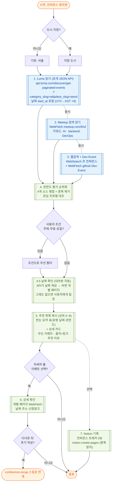

```mermaid
flowchart TD
    A([시작: 컨퍼런스 찾아줘]) --> B{도시 지정?}
    B -- 아니오 --> C[기본: 서울]
    B -- 예 --> C2[지정 도시]
    C --> D
    C2 --> D

    D[["1. Luma 읽기 (공개 JSON API)<br/>api.luma.com/discover/get-paginated-events<br/>?category_slug=ai&place_slug=seoul<br/>날짜 start_at 포함 (UTC→KST +9)"]] --> F
    E[["2. Meetup 검색 읽기<br/>WebFetch meetup.com/find<br/>키워드: AI · backend · DevOps"]] --> F
    W[["3. 웹검색 + Dev-Event<br/>WebSearch 큰 컨퍼런스<br/>+ WebFetch github Dev-Event"]] --> F
    D -.동시.- E
    E -.동시.- W

    F[["4. 관련도 평가·순위화<br/>4개 소스 병합 + 중복 제거<br/>관심 프로필 대조"]] --> G{"사용자 조건<br/>주제·무료·요일?"}
    G -- 있음 --> H[조건으로 우선 필터]
    G -- 없음 --> J
    H --> J

    J[["4.5 날짜 확인 (대부분 자동)<br/>API가 날짜 제공 → 비면 개별 페이지<br/>그래도 없으면 사용자에게 질문"]] --> K

    K[["5. 추천 목록 제시 (상위 5~8)<br/>한눈 요약 표(유형·날짜·관련도)<br/>+ 상세 카드<br/>· 무슨 이벤트 · 출처+링크 · 추천 이유"]] --> L{자세히 볼<br/>이벤트 선택?}
    K -.선택.-> R[["7. Notion 기록<br/>컨퍼런스 트래커 DB<br/>notion-create-pages (중복 방지)"]]
    R --> N

    L -- 예 --> M[["6. 상세 확인<br/>개별 페이지 WebFetch<br/>날짜·주소·신청링크"]]
    L -- 아니오 --> N([종료])
    M --> O{다녀온 뒤<br/>후기 작성?}
    O -- 예 --> P([conference-recap 스킬로 연계])
    O -- 아니오 --> N

    classDef src fill:#e3f2fd,stroke:#1565c0,color:#0d47a1;
    classDef step fill:#f1f8e9,stroke:#558b2f,color:#33691e;
    classDef done fill:#fff3e0,stroke:#e65100,color:#e65100;
    class D,E,W src;
    class F,J,K,M,R step;
    class A,N,P done;
```
