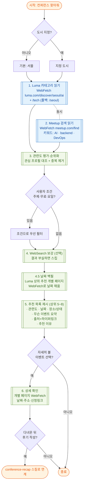

```mermaid
flowchart TD
    A([시작: 컨퍼런스 찾아줘]) --> B{도시 지정?}
    B -- 아니오 --> C[기본: 서울]
    B -- 예 --> C2[지정 도시]
    C --> D
    C2 --> D

    D[["1. Luma 카테고리 읽기<br/>WebFetch luma.com/discover/seoul/ai<br/>+ /tech (폴백: /seoul)"]] --> F
    E[["2. Meetup 검색 읽기<br/>WebFetch meetup.com/find<br/>키워드: AI · backend · DevOps"]] --> F
    D -.동시.- E

    F[["3. 관련도 평가·순위화<br/>관심 프로필 대조 + 중복 제거"]] --> G{"사용자 조건<br/>주제·무료·요일?"}
    G -- 있음 --> H[조건으로 우선 필터]
    G -- 없음 --> I
    H --> I

    I[["4. WebSearch 보강 (선택)<br/>결과 부실하면 스킵"]] --> J
    J[["4.5 날짜 백필<br/>Luma 상위 추천 개별 페이지<br/>WebFetch로 날짜 채움"]] --> K

    K[["5. 추천 목록 제시 (상위 5~8)<br/>· 관련도 · 날짜 · 장소/상태<br/>· 무슨 이벤트 요약<br/>· 출처+하이퍼링크<br/>· 추천 이유"]] --> L{자세히 볼<br/>이벤트 선택?}

    L -- 예 --> M[["6. 상세 확인<br/>개별 페이지 WebFetch<br/>날짜·주소·신청링크"]]
    L -- 아니오 --> N([종료])
    M --> O{다녀온 뒤<br/>후기 작성?}
    O -- 예 --> P([conference-recap 스킬로 연계])
    O -- 아니오 --> N

    classDef src fill:#e3f2fd,stroke:#1565c0,color:#0d47a1;
    classDef step fill:#f1f8e9,stroke:#558b2f,color:#33691e;
    classDef done fill:#fff3e0,stroke:#e65100,color:#e65100;
    class D,E src;
    class F,I,J,K,M step;
    class A,N,P done;
```
